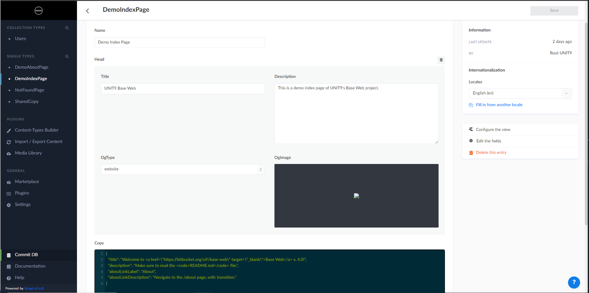
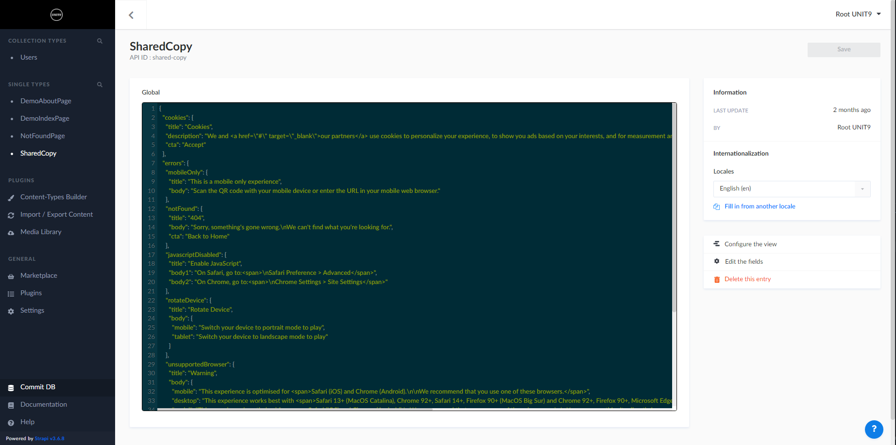
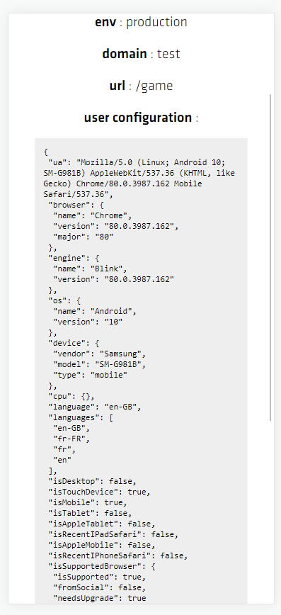
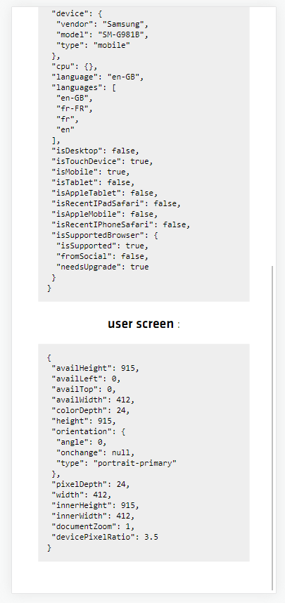

# Base Web boilerplate
 

---

The Base Web boilerplate builds upon Next.js to cover all of the common needs for web development.

*Why not create a package and import it as a dependency?*
It has been attempted before, but it doesn't work well given our workflow where we need to be able to customise everything per-project.
We would end up trying to hack the package to override its built-in logic. This approach gives much more flexibility and avoids any extra packaging hassle.

This document is a manual for the boilerplate, but can double as a new tech lead onboarding resource.
<br />

## Main features
All of Next.js' features, plus...

- A responsive system
- A robust styling system: typography system (with localised font support), colour palette, shared layout values
- A custom locale detection system: browser-based or IP-based
- SSR-friendly localised copy management (with or without the CMS)
- SSR-friendly localised non-functionals
- Boilerplate utilities: detailed platform detection, Google Tag Manager, etc.
- Boilerplate hooks: window size change (with orientation info), page scroll, [asset preloader](#using-the-preloaderservice) with device-specific support, intersection observer, etc.
- Boilerplate advanced services: [audio engine](./docs/audioManager.md), [event manager](#using-the-eventmanager), ticker, etc.
- Boilerplate components: Head, Version info, Lottie player, etc.
- Local HTTPS support
- User-friendly CSP configuration
- An infrastructure ready for deployment to Google Cloud Run using Bitbucket Pipelines
<br />

## Tech stack
##### Front-end
- [TypeScript](https://www.typescriptlang.org)
- [React](https://reactjs.org/docs/getting-started.html)
- [Next.js](https://nextjs.org/docs/getting-started)
- [Webpack](https://webpack.js.org/concepts)
- [Node.js](https://nodejs.org/dist/latest-v16.x/docs/api)
- [Express](http://expressjs.com/en/4x/api.html)
- [Axios](https://axios-http.com/docs/intro)
- [Strapi](https://docs-v3.strapi.io/developer-docs/latest/getting-started/introduction.html)
- [GraphQL](https://graphql.org)
- [styled-components](https://styled-components.com)
- [polished](https://polished.js.org/docs)
- [framer-motion](https://www.framer.com/docs)
- [GSAP](https://greensock.com/docs)
- [Lottie](https://airbnb.design/lottie/)
- [howler.js](https://github.com/goldfire/howler.js)
- [Zustand](https://github.com/pmndrs/zustand)
- [Storybook](https://storybook.js.org/docs/react/get-started/introduction)
- [Sentry](https://docs.sentry.io/platforms/javascript/guides/react)
<br />

##### Infrastructure
- [PM2](https://pm2.keymetrics.io)
- [Terraform](https://www.terraform.io)
- [Docker](https://docs.docker.com)
- [Bitbucket Pipelines](https://support.atlassian.com/bitbucket-cloud/docs/build-test-and-deploy-with-pipelines)
- [Google Cloud Run](https://cloud.google.com/run)
<br />

## Browser compatibility
All modern browsers (Chrome, Firefox, Opera, Edge, Safari, etc.), with no required configuration.
Internet Explorer is **not** compatible out-of-the-box. The pages won't load as some dependencies compile to ES6+.
<br />

---
## Contents
- [Quick start](#quick-start)
  - [Front-end developer TL;DR](#front-end-developer-tldr)
  - [Requirements](#requirements)
- [Architecture](#architecture)
- [Components vs Containers](#components-vs-containers)
- [Components](#components)
  - [SVGs](#svgs)
- [Styling](#styling)
  - [Localised fonts](#localised-fonts)
- [Responsive](#responsive)
  - [Configuring the responsive scaling](#configuring-the-responsive-scaling)
- [State management](#state-management)
- [Copy management and localisation](#copy-management-and-localisation)
  - [Page copy decks](#page-copy-decks)
  - [Shared copy deck](#shared-copy-deck)
  - [GraphQL queries](#graphql-queries)
  - [Localisation](#localisation)
  - [Copy management without the CMS](#copy-management-without-the-cms)
- [Built-in tools](#built-in-tools)
  - [Utility components](#utility-components)
  - [Non-functionals](#non-functionals)
    - [Adjusting the supported browsers](#adjusting-the-supported-browsers)
  - [Hooks](#hooks)
  - [Services](#services)
  - [Utilities](#utilities)
- [Recipes](#recipes)
  - [Handling GTM tracking](#handling-gtm-tracking)
  - [Handling shared layouts](#handling-shared-layouts)
  - [Handling sequenced animations](#handling-sequenced-animations)
  - [Handling the audio's muted state](#handling-the-audios-muted-state)
  - [Handling section visibility detection on scroll](#handling-section-visibility-detection-on-scroll)
  - [Handling debugging flags](#handling-debugging-flags)
  - [Using the `EventManager`](#using-the-eventmanager)
  - [Using the `PreloaderService`](#using-the-preloaderservice)
  - [Using the `TickerService`](#using-the-tickerservice)
  - [Adjusting the basic auth](#adjusting-the-basic-auth)
  - [Adjusting the CMS data sync in production](#adjusting-the-cms-data-sync-in-production)
  - [Adjusting the public URL](#adjusting-the-public-url)
  - [Enabling HTTPS locally](#enabling-https-locally)
  - [Enabling nonce support (experimental)](#enabling-nonce-support-experimental)
- [What's next?](#whats-next)

<br />

---
## Quick start
In the root folder, run `npm i`. If you are initialising the repo, run `npm run setup`, then follow the indicated steps.
`setup` is used once per project and will generally be done by the tech lead when initialising the repository. The main scripts you'll use are:

`package.json`
  - `start`: Launches the app

`/frontend/package.json`
  - `storybook`: Starts Storybook
  - `new-component ComponentName`: Bootstraps a component (template .tsx, .styles.ts and .stories.tsx files) in `/frontend/components/ComponentName`

Any dependency added to `/frontend/package.json` and `/cms/package.json` should be version-locked (`npm install <package>@<version> -E`) to avoid incompatible and bugged future versions.
<br />

##### Front-end developer TL;DR
- Always use `rem` or `em` units in your styles (except for minor elements like `border: 1px solid someColor`). It's used to make everything responsive automatically.
- You can access the list of all existing typography styles (defined in `/frontend/utils/styles/theme.ts`), components and SVGs on Storybook.
- Use typography styles by doing `${({ theme: { locale } }) => setTypography('someStyle', locale)}`.
- Use the colour palette by importing it from `/frontend/utils/styles/theme.ts`.
- Have a look at the `/frontend/src/template/hooks`, `/frontend/src/template/utils` (especially `/frontend/src/template/utils/platform.ts`) and `/frontend/src/utils` folders so you can see the boilerplate tools you can use.
- Have a look at the existing environment variables in `/frontend/env.js`.
Use `IS_DEBUG` as a condition to wrap any pertinent debugging log or behaviour (if it's not something QA could use, please delete it before committing).
- You can access a user configuration report by adding `#buildInfo` to your URL (eg. locally, http://localhost:3000/#buildInfo).
This is useful if there's a QA behaviour you can't reproduce as you can ask them to send you a screenshot of that screen.
This option is disabled on the `staging` and `production` environments as the `IS_DEBUG` environment variable is `false` there.
- *... But really, read at least [Components](#components), [Styling](#styling) and [Responsive](#responsive).*

Make sure to read the other sections when you get to the points they cover in production.
<br />

##### Requirements
- node 16+, npm 8+
- Docker
- pm2

<br />

---

## Architecture
Here are the main directories and files you'll work with:
```
/frontend
  /.storybook
  /public
  /scripts
  /server
  /src
    /assets
    /components
    /containers
    /hooks
    /pages
    /services
    /svgs
    /types
    /template
      /components
      /containers
      /hooks
      /services
      /utils
    /utils
      /cms
      /styles
  env.js
  next.config.js
  package.json
```
<br />

### `/frontend`
- `/frontend/.storybook`: Configuration files for Storybook
- `/frontend/public`: Static files. Example use: `url('/fonts/customFont/CustomFont-Regular.woff2')`
- `/frontend/scripts`: Tooling scripts for development
- `/frontend/server`: The custom Express server setup
- `/frontend/src`: The Next.js app
- `/frontend/env.js`: The environment variables passed to the Next.js app
- `/frontend/next.config.js`: The Next.js app's configuration file.
- `/frontend/package.json`: The Next.js app's `package.json` file
<br />

### `/frontend/src`
- `/frontend/src/assets`: Assets imported within the build.
- `/frontend/src/components`: All non-page components
- `/frontend/src/containers`: All page components
- `/frontend/src/hooks`: Custom hooks reused accross the app
- `/frontend/src/pages`: Next.js pages
- `/frontend/src/services`: Custom app services
- `/frontend/src/svgs`: All SVG files
- `/frontend/src/types`: Type declaration files for specific file extensions
- `/frontend/src/template`: Boilerplate components, containers, hooks, services and utilities
- `/frontend/src/utils`: Custom app utilities
<br />

The `DemoIndexPage` and `DemoAboutPage` containers are placeholders only and should be deleted when obsolete (also from Strapi). When preparing the project, the tech lead should remove non-applicable boilerplate elements under `/frontend/template` as well as their dependencies to make the build lighter (eg. the audio manager service, its demo sounds under `/frontend/assets/sounds` and howler.js -- same thing for the `Lottie` component and its dependencies, etc.).

Any asset used in the build via `import` (images, light sound files, Lottie JSON files, etc.) can be preloaded with the [`PreloaderService`](#using-the-preloaderservice). The rest can be placed in `/frontend/public` (fonts, heavy assets, etc.).

Environment variables are set in `/frontend/env.js`. However, accessing `process.env` from the client environment hardcodes the value in the front-end build and exposes any secret key directly in the browser. For security reason, it's best to set client-side environment keys requiring to be dynamic (eg. `PUBLIC_URL` might have a given value at initial build time, but another if the Docker containe is then deployed to another server which overwrites the variable's value) or secure in Next.js' public runtime configuration (`getNextConfig().publicRuntimeConfig;`). See [Next.js' documentation](https://nextjs.org/docs/pages/building-your-application/configuring/environment-variables#bundling-environment-variables-for-the-browser) on the matter for more info.

<br />

---

## Components vs Containers
Containers are page components. They have a single instance in the app, and are instantiated by Next.js through the pages. They're unlikely to have a Storybook story as they rely on app logic first.
For example, if we want to add a `/contact` page:

`/frontend/src/pages/contact.tsx`:
```tsx
export { default, getStaticProps } from 'containers/ContactPage/ContactPage';
```

`/frontend/src/containers/ContactPage/ContactPage.tsx`:
```tsx
import { GetStaticProps } from 'next';
import { Router } from 'next/router';

import { ROUTES } from 'utils/routes';

import * as Styled from './ContactPage.styles';

export const getStaticProps: GetStaticProps = async () => {
  // ...
};

interface ContactPageProps {
  router: Router;
}

const ContactPage: React.FunctionComponent<ContactPageProps> = () => {
  return <Styled.Wrapper>The contact page</Styled.Wrapper>;
};

export default ContactPage;
```
<br />

In that sense, a container's only instance is in `/frontend/src/pages/_app.tsx`:
```tsx
<Component key={router.route} router={router} {...pageProps} />
```
<br />

Make sure to update the `ROUTES` dictionary in `/frontend/src/utils/routes.ts` with `'CONTACT': '/contact'` so it can later be accessed via `ROUTES.CONTACT`.

<br />

---
## Components
Each component has a `Component.tsx` file (not `index.tsx`, which makes it harder to identify them in the IDE when a lot of files are open) and a file for its styles, `Component.styles.ts`. The styles are then imported in `Component.tsx` with `import * as Styled from './Component.styles.ts'`, and used with `<Styled.StyledComponent />`. This is fairly useful to reduce the amount of files in the bundle, but also to identify styled-components directly in a JSX tree.

A component's Storybook stories can be found in `Component.stories.tsx`.
*Two useful stories are the one listing all SVGs for the project, and the typography scale, so all developers can quickly get a reference for which typography styles are available.*

The script `npm run new-component Component` will create all three of these files automatically under the `/frontend/components/Component` folder.
<br />

### SVGs
SVGs are to be put under `/frontend/svgs`. Make sure to adjust the width and height properties as well as the colour to allow for responsiveness and easy CSS colour changes.

Example:

```xml
<svg width="18" height="18" viewBox="0 0 18 18" fill="none" xmlns="http://www.w3.org/2000/svg">
  <line x1="5.42004" y1="5.15625" x2="12.8447" y2="12.5809" stroke="black" stroke-width="1.5" stroke-linecap="round"/>
  <line x1="12.6104" y1="5.18566" x2="5.18573" y2="12.6103" stroke="black" stroke-width="1.5" stroke-linecap="round"/>
</svg>
```

should become
```xml
<svg width="100%" height="100%" viewBox="0 0 18 18" fill="none" xmlns="http://www.w3.org/2000/svg">
  <line x1="5.42004" y1="5.15625" x2="12.8447" y2="12.5809" stroke="currentColor" stroke-width="1.5" stroke-linecap="round"/>
  <line x1="12.6104" y1="5.18566" x2="5.18573" y2="12.6103" stroke="currentColor" stroke-width="1.5" stroke-linecap="round"/>
</svg>
```

so we can have the SVG's color change automatically (transition included) when doing
```tsx
export const SomeDiv = styled.div<{ color: ColorNames }>`
  color: ${({ color }) => colors[color]};
  transition: color 0.2s ease-out;
`;

---

import { ReactComponent as SvgClose } from 'svgs/close.svg';

import * as Styled from './SomeComponent.styles';

// ...

<Styled.SomeDiv color={color}>
  <SvgClose />
</Styled.SomeDiv>
```

<br />

---
## Styling
Setting the typography scale and colour palette (along with the width of the design references, see [Responsive](#responsive)) should be done **first thing** after production kick-off. The tech lead can ask the designers to setup and keep them up-to-date in the Figma file. This helps avoiding near-identical and non-harmonised typography styles and colours accross a project. *Note: I suggest also asking the designers to merge near-identical styles and colours where possible.* Custom fonts can be added in `/frontend/utils/styles/fonts.ts`.

Once defined in `/frontend/utils/styles/theme.ts`, the typography scale can be used in a styled-component with the `setTypography` mixin. `font-size` and `word-spacing` use `rem` units, `letter-spacing` uses `em` units (more on that in the [Responsive](#responsive) section). To maintain harmonised styles in the project, there shouldn't be uses of the properties covered by the mixin (`font-size`, `font-weight`, etc. -- full list in the `FontCategory` interface in `/frontend/utils/styles/theme.ts`) in the styled-components themselves. Similarly, the colour palette should also always be referenced.

Colour names should be defined with the [Name That Color](https://chir.ag/projects/name-that-color) tool to avoid the infamous `lighterBlue5` kind of situations. polished should be used for colour manipulation.

For example:
`/frontend/utils/styles/mixins.ts`:
```ts
import { colors, layout } from 'utils/styles/theme';

// ...

export const roundedCorners = (hasOnlyTopLeft = false) => `
  border-radius: ${hasOnlyTopLeft ? `12rem 0 0 0` : '12rem'};
  border: 1px solid ${rgba(colors.black, layout.lineOpacity)};
`;

```
<br />

`/frontend/components/SomeComponent/SomeComponent.styles.ts`:
```ts
import { rgba } from 'polished';

import { roundedCorners, setTypography } from 'utils/styles/mixins';
import { colors, layout } from 'utils/styles/theme';

export const Heading = styled.h2`
  ${({ theme: { locale } }) => setTypography('heading2', locale)}
`;

export const Popup = styled.div<{ hasTopLeftRoundedCorner?: boolean; }>`
  background-color: ${rgba(colors.blueRibbon, 0.9)};
  z-index: ${layout.zIndex.popup};
  ${({ hasTopLeftRoundedCorner }) => roundedCorners(hasTopLeftRoundedCorner)}
`;
```
<br />

We do not want:
```ts
export const Heading = styled.h2`
  ${({ theme: { locale } }) => setTypography('heading2', locale)}
  font-weight: bolder;
`;

export const Popup = styled.div<{ hasTopLeftRoundedCorner?: boolean; }>`
  color: rgba(0, 112, 243, 0.9);
  z-index: ${layout.zIndex.popup};
  ${({ hasTopLeftRoundedCorner }) => roundedCorners(hasTopLeftRoundedCorner)}
`;
```
<br />

*Note: If a computed colour (eg. `rgba(colors.blueRibbon, 0.9)`) is reused often, it might be a good idea to store it in the palette.*

Making use of TypeScript, all available options for `setTypography`, the colors colour palette and the common values in `layout` in `/frontend/utils/styles/theme.ts` will be auto-suggested.

**The `!important` flag should never be needed**, unless a third party stylesheet's rules need to be overriden manually. This breaks the styles' cascading logic and makes them hard to maintain.
<br />

### Localised fonts

A given `FontCategory`'s `fontFamily` property can accept different locales, should the font need to be different depending on the locale (but everything stays the same):


The default font and the Korean one share the same styles (preferred):
```ts
{
  heading1: {
    fontFamily: { default: FontNames.circularStd, ko: FontNames.doHyeon },
    fontSize: { desktop: 200, tablet: 100, mobile: 66 },
    lineHeight: { desktop: 1.265, tablet: 1.265, mobile: 1.265 },
    fontWeight: 900,
    fontStyle: 'italic',
    textTransform: 'uppercase',
  }
}
```
<br />

The default font and the Korean one need too many different adjustments, a separate category is created:
```ts
{
  ribbon: {
    fontFamily: { default: FontNames.presto, ko: FontNames.doHyeon },
    fontStretch: 'expanded',
    fontSize: { desktop: 15, tablet: 12, mobile: 10 },
    lineHeight: { desktop: 0.96, tablet: 0.96, mobile: 0.96 },
    fontWeight: 400,
    textTransform: 'uppercase',
  },
  ribbonKorean: {
    fontFamily: { default: FontNames.doHyeon },
    fontStretch: 'expanded',
    fontSize: { desktop: 20, tablet: 12, mobile: 12 },
    lineHeight: { desktop: 0.8, tablet: 0.8, mobile: 0.8 },
    wordSpacing: 0.5,
    fontWeight: 700,
    textTransform: 'uppercase',
  }
}
```
<br />

The `locale` parameter is provided to the styled-components in `_app.tsx`:
```tsx
<ThemeProvider theme={{ ...theme, locale: router.locale }}>
```

<br />

---

## Responsive
A global `font-size` is set on the `html` element, in `vw` or `vh` (depending on the active breakpoint). This allows `rem` units to scale responsively automatically.
As such, all elements should use `rem` or `em` units, with the exception of `1px` borders and the like.

When used, `vh` units should be used with the `setVh(number)` mixin, which solves a Safari bug (cf. https://css-tricks.com/the-trick-to-viewport-units-on-mobile/). Example:

```ts
import { setVh } from 'utils/styles/mixins';

export const SomeDiv = styled.div`
  height: ${setVh(100)};
`;
```

If needed, several mixins for media queries are available for more precision in `/frontend/utils/styles/responsive.ts`. For example:
```ts
export const Heading = styled.h4`
  ${({ theme: { locale } }) => setTypography('heading4', locale)}
  ${({ theme: { locale } }) => mediaTablet(`
    ${setTypography('heading5', locale)}
  `)}
`;
```

*Note: They should always be used in a mobile-first order.*

### Configuring the responsive scaling
The width of the design references is set in `/frontend/utils/styles/vars.ts`. It is used to scale the entire project responsively. As such, it should be defined **at production kickoff** to avoid having to adjust all `rem` and `em` units across the project after a significant change. If the scalar for a given breakpoint is twice as big as the one you had previously, all elements (including typography) on that breakpoint will become twice as big visually.

By default, responsive scaling is based on the active breakpoint (mobile, tablet or desktop), using the matching design reference's width (eg. 360px on mobile, 1920px on desktop). The tablet's width is set to the desktop value by default, as most projects don't have separate references designed for tablets. If this is the case for the project however, you should set this value to the tablet design reference's width (make sure to adjust the tablet breakpoint in the typography scale accordingly).

Linear responsive scaling can be enabled with the `USE_LINEAR_SCALING` environment variable `/frontend/env.js`. When enabled, the elements will scale uniformly relatively to the mobile width only, and will ignore the tablet and desktop breakpoints.

This file can also be edited to adjust the breakpoints and the minimum window size on desktop. Additionally, minimum responsive font size can be set per device type (eg. if `minFontSize.desktop` is set to 12, the font size on the desktop breakpoint will never scale down below 12px regardless of the window size).

The `ALLOW_USER_ZOOM` environment variable can be toggled in `/frontend/env.js`. This is disabled by default as on most of our projects we want the original design to scale exactly as it is. If design fidelity isn't a priority (unlikely for experiental webapps but might apply for regular websites with native zoom level behaviour), it can be set to `true`.

<br />

---

## State management
- New Zustand stores should be added to `/frontend/src/store/index.ts`.
- The stores are available at the bottom of the React tree in the React Developer Tools for debugging.
- Getters are available as the second parameter of the `create` function. Example:
  ```ts
  const useAudioStore: UseBoundStore<AudioStoreType> = create(
    (
      set: (partial: (store: AudioStoreType) => Partial<AudioStoreType>) => void,
      get: () => AudioStoreType
    ) => {
      return {
        isMuted: false,
        isUserMuted: false,
        setMuted: (state, isFromUser = false) => {
          set(() => ({
            isMuted: state,
            isUserMuted: isFromUser,
          }));

          // ...
        },
        toggleMuted: () => {
          const { isMuted, setMuted } = get();
          const newState = !isMuted;
          setMuted(newState, true);

          return newState;
        },
      };
    }
  );
  ```
- `.data.ts` files are used when the default state's logic would be too long to store in the store file itself. eg. `/frontend/src/store/copy.data.ts`
- `.types.ts` files are similarly used for complex type definitions for a given store. eg. `/frontend/src/store/copy.types.ts`

<br />

---
## Copy management and localisation
Each language's copy deck is stored in JSON files in `/frontend/src/store/translations/{locale}`. `head.json` contains the head data for each page. The page key should match what is in the `Pages` enum in `/frontend/src/utils/routes.ts`.
<br />

##### Page copy decks
Each page has its own copy deck. For example, `DemoIndexPage` has a `demoIndexPage.json` file (cf. `/frontend/src/store/translations/en/demoIndexPage.json`) and a `DemoIndexPageCopy` interface (cf. `/frontend/src/store/copy.types.ts`). This is reflected in the Strapi structure, where a single type is created for each page. Each page has a `head` component, as well as a JSON `copy` field where its copy deck will go.



<br />
<br />

The only page not to have a `copy` field is the `NotFoundPage`, as its copy deck is stored in the shared copy deck (because any URL might need to fetch it).

After updating Strapi, **make sure to update the JSON files with your changes**. They are used as references to check any copy updates made to `init.sql`.
<br />

##### Shared copy deck
Most websites will have error messages and a cookie banner to show (possibly an age gate). These are stored in the `global` shared copy.



<br />
<br />

In websites where there is also shared copy accross the pages (header, footer, modals, overlays, etc.), creating another JSON field for the `app` shared copy is useful. For example:

```ts
export interface GlobalCopy {
  // ...
}

export interface AppCopy {
  footer: {
    links: {
      label: string;
      url: string;
    }[];
    disclaimer: string;
  };
  modals: {
    error: {
      title: string;
      body: string;
      cta1: string;
    };
    exit: {
      title: string;
      body: string;
      cta1: string;
      cta2: string;
    };
    pause: {
      title: string;
      body: string;
      cta1: string;
      cta2: string;
    };
  };
}

export interface SharedCopy {
  global: GlobalCopy;
  app: AppCopy;
}
```
<br />

##### GraphQL queries
Now that we've created a new field for the `app` shared copy, we need to update our copy queries to fetch it. This is easily done in `/frontend/src/utils/cms/gql`.

```ts
export const demoIndexPageQuery = ({
  locale = process.env.DEFAULT_LOCALE,
}: QueryBaseProps): DocumentNode => gql`
  {
    sharedCopy(locale: "${locale}") {
      global,
      app
    },
    demoIndexPage(locale: "${locale}") {
      ${headFragment},
      copy
    }
  }
`;
```
<br />

Make sure to also update your page's container's data fetching method and props interface.
```ts
export const getStaticProps: GetStaticProps = async ({ locale }) => {
  const response = await cmsApiClient.query({
    query: demoIndexPageQuery({ locale }),
  });

  const { sharedCopy, demoIndexPage: page } = response.data;
  if (!page || !sharedCopy) return { notFound: true };

  const { head, copy } = page;

  return {
    props: {
      initialCopy: {
        head,
        global: sharedCopy.global,
        app: sharedCopy.app,
        index: copy,
      },
    },
    // ...
  };
};

interface DemoIndexPageProps {
  initialCopy: {
    head: CopyStoreType['copy']['head'];
    global: CopyStoreType['copy']['global'];
    app: CopyStoreType['copy']['app'];
    index: CopyStoreType['copy']['index'];
  };
  router: Router;
}
```
<br />

##### Localisation
Localisation is enabled by default. We use Strapi's internalisation feature to handle multilingual copy decks. Supported locales can be set in `/frontend/env.js`.
Locale detection uses a custom script in `/frontend/server/middlewares/localeDetection.js`. By default, it uses the browser's config to pick the locale.
It's however possible to use IP-based locale detection by toggling the feature on in `/frontend/env.js`. `GEOIP_MAPPING` is a dictionary expecting a country code mapped to a locale code.

It's also possible to revert to Next.js's default locale detection behaviour by setting both `USE_BROWSER_LOCALE` and `USE_GEOIP_LOCALE` to `false`.
*Note: I would however recommend against it as its behaviour is known to sometimes be a bit unpredictable.*
<br />


##### Copy management without the CMS
It's also possible to only rely on static files to handle the copy management. This can simplify development greatly if the CMS isn't otherwise needed on the project, and the copy is known not to need to change often, or at all. In that case, page's container's data fetching method will simply be changed to:

```ts
import { getCopy } from 'store/copy.data';

// ...

export const getStaticProps: GetStaticProps = async ({ locale }) => {
  // Any other server-side async call

  const initialCopy = getCopy(Pages.index, locale);

  return {
    props: {
      initialCopy,
    },
    // ...
  };
};
```

<br />

---
## Built-in tools
The following tools are included under `/frontend/src/template`.

### Utility components
- `ErrorBoundary`: React ErrorBoundary component used locally. On non-local environments, the [Sentry error boundary component](https://docs.sentry.io/platforms/javascript/guides/react/components/errorboundary/) is used instead. Both are instanced in `/frontend/src/pages/_app.tsx`.
- `Head`: Component for the `<head>` tag. Updates automatically based on the current copy.
- `LanguageSelector`: Placeholder language selector for the demo project.
- `Lottie`: Lottie player.
- `/versioning/Version`: Shows the version tag.
- `/versioning/BuildInfo`: Detailed user config report. This is useful if there's a behaviour you can't reproduce as you can ask the team member or the client to send you a screenshot of that screen, accessible at `#buildInfo`. This is disabled on the `staging` and `production` environments.
<p align="center">
  
  
</p>
<br />

### Non-functionals
By default, are included:
- `JavaScriptDisabled`
- `MobileOnly`
- `NotFound`
- `RotateDevice`
- `SocialBrowserUnsupported`
- `UnsupportedBrowser`
- `UnsupportedBrowserBanner`
- `WebGLDisabled`
- `WindowTooSmall`

Feel free to remove those that don't apply to the project by deleting their components and removing them from `/frontend/src/template/containers/NonFunctionals/NonFunctionals.tsx`.
The detection relies on the `/frontend/src/template/utils/platform.ts` utility. As such, the logic in `NonFunctionals.tsx` can easily be tweaked to cover other use cases (eg. replacing `MobileOnly` by `DesktopOnly`).

An error can be triggered by accessing the `/make-frontend-error` URL. This can be used to test Sentry is properly implemented.

##### Adjusting the supported browsers
This can be done in `/frontend/src/template/utils/platform.ts` by changing the `ALLOWED_BROWSERS` variable.
A supported browser with a version below `recommendedMinVersion` will trigger the `UnsupportedBrowserBanner` to show. If `minVersion` is set and its version is below it, the `UnsupportedBrowser` screen will show instead.

On non-desktop devices, the default practice is to allow unsupported browsers, but to simply show the banner as a warning. This can be turned off by toggling `SHOULD_WARN_UNSUPPORTED_MOBILE_BROWSER`.

<br />

### Hooks
- `useDisableScroll`
- `useIntersectionObserver`: Accepts an options object with two properties.
  - `threshold`: Number between 0 and 1. Sets how visible the element needs to be to be considered in view.
  - `triggerOnce`: Boolean. Sets whether the visibility event should only be triggered once.
- `usePageVisibility`
- `usePreloadDirectory`: Accepts an array of directories (or a single string) to load, and returns the progress as a number between 0 and 100.
  Check [Using the `PreloaderService`](#using-the-preloaderservice) for more information.
- `useSectionVisibility`: Check [Handling section visibility detection on scroll](#handling-section-visibility-detection-on-scroll) for more details.
- `useScroll`
- `useSvgIcon`
- `useTouch`
- `useWindowSize`
  - `setListeners`: Boolean, optional. Only to be set to `true` once per app.
  This should be done on the highest level component using the hook, usually the app or non-functionals container. By default, this is done in the non-functionals.
<br />

### Services
- `audioManager`: The audio engine. Check the [separate documentation](./docs/images/audioEngine.md) for more information.
- `eventManager`: An event manager, useful when creating games (eg. passing game data or events back to the React view). Used by the audio engine under the hood. Check [Using the `EventManager`](#using-the-eventmanager) for more information.
- `intersection`: Runs under the hood for the `useIntersectionObserver` hook. Shouldn't be used directly.
- `preloader`: Runs under the hood for the `usePreloadDirectory` hook and the `AudioManager`. Check [Using the `PreloaderService`](#using-the-preloaderservice) for more information.
- `resize`: Runs under the hood for the `useWindowSize` hook. Shouldn't be used directly. Some mobile browsers only update `window.innerHeight` when the rotate animation finishes. In order to ensure we have the latest computed values in `useWindowSize`, the `onResize` method is debounced on mobile. `MOBILE_DEBOUNCE_DELAY` can be reduced as seen fit if needed (defaults to a safe 250ms, has been QA'd up to 50ms, anything below might lead to issues).
- `ticker`: A simple ticker useful when scheduling and keeping events in sync. Check [Using the `TickerService`](#using-the-tickerservice) for more information.
<br />

### Utilities
- `debounce`: Inspired by Lodash's `debounce` method, but cancellable (useful to cleanup on unmount).
- `dom`
- `easings`
- `gtm`: Check [Handling GTM tracking](#handling-gtm-tracking) for more details.
- `passiveEvent`
- `path`
- `platform`: Used for platform and device-related checks. For conditional layout rendering within a component, prefer `isMobileLayout()` in `/frontend/src/utils/styles/responsive.ts` to `isMobile()`.
- `popup`
- `share`
- `thirdParty`: Used to check a third party script is present in the `window` object. Useful when no `onReady` event is available.
- `time`
- `url`

<br />

---
## Recipes
### Handling GTM tracking
We can use the `gtm` boilerplate utility to do so. It handles Google Tag Manager by default, but can be tweaked to handle Google Analytics. It should be ininitialised once the user has given consent.

Example initialisation in the cookie banner:
```ts
const checkCookies = () => {
  const cookies = Cookies.get(`${NAMESPACE}.cookiesConsent`);
  setVisible(!cookies);
  GTM.initialize(cookies === 'true');
};

const onAccept = () => {
  close(true);
  GTM.initialize(true);
  GTM.trackEvent('Cookie', 'Click', 'Cookies accepted');
};

const close = (shouldAccept: boolean) => {
  Cookies.set(`${NAMESPACE}.cookiesConsent`, shouldAccept, { expires: 365 });
  setVisible(false);
};

useEffect(checkCookies, []);
```

*Note: `NAMESPACE` here is stored in `/frontend/src/utils/localStorage.ts` as the local storage uses the same key.*
<br />

Page changes can be tracked automatically by adding this snippet to `/frontend/src/pages/_app.tsx`:
```ts
useEffect(() => {
  GTM.trackPage();
}, [router.pathname]);
```
<br />

### Handling shared layouts
If different pages share the same structure, it might be worth creating a layout. When there are several layouts, a `LayoutManager` can be useful to select the appropriate layout automatically based on the route, as well as to keep the architecture clear (and avoid portals as well as hard-to-manage z-indexes). This is especially useful if modals are used, as it can be the ideal place to put elements that should always be on top (cookie banners, age gates, etc.)

<br />

### Handling sequenced animations
We will create `.motion.ts` hook files for our GSAP animations.

##### In a reusable component

`useMotion()` is used to set the references to the DOM elements we want to animate. It also passes a reference to the `show()` method used to trigger the animation. We trigger method when the component mounts (if we want it to auto-play). We could also create a `hide()` method that would trigger a different timeline for hiding the component. `useImperativeHandle` is used so we can trigger the `show()` method from a parent component.
<br />

##### Sequencing component timelines

We can pass arguments to `useMotion()` to add conditional behaviours to our animations. In the animation hook, we can call `button.current.show()` to add the `Button` component's timeline to the `Slide` component's. Note that the button animation will only be triggered if this slide happens to use a button.
<br />

### Handling the audio's muted state
We want to mute the audio when the tab is inactive, as well as save the user's preferred muted state for the next session. To do that we can create an audio store that'll store the state and pass it to the localStorage if the change came from the user (ie. not an auto-mute when switching tabs). We can then add the auto-mute logic and restore the previous session state on mount in `/frontend/src/pages/_app.tsx`.
<br />

### Handling section visibility detection on scroll
We can use the `useSectionVisibility` and `useIntersectionObserver` hooks to achieve this.

```tsx
const { setCurrentSlide } = useGlobalStore();
const {
  currentSection,
  updateSectionVisbility
} = useSectionVisibility(slides.length);

// ...

useEffect(() => {
  setCurrentSlide(currentSection);
}, [currentSection]);

// ...

slides.map(_, index) => (
  <Slide
    // Slide should be using the `useIntersectionObserver` hook
    // and exposing the `isInViewport` property in its ref with `useImperativeHandle`
    ref={(ref) => {
      if (!ref) return;
      // ...

      updateSectionVisbility(ref.isInViewport, index);
    }}
  />
);
```

<br />

### Handling debugging flags
Using the `IS_DEBUG` environment variables, URL flags can easily be setup for development and QA testing. A dictionary of the existing flags can be put in `/frontend/src/_app.tsx` and shared with the QA team.


*Note: The local `IS_DEBUG` variable is used to toggle logs for that specific file.*
<br />

### Using the `EventManager`
```ts
// Creating a new instance
const eventManager = new EventManager();

// Registering events
eventManager.registerEvent('anEvent');
eventManager.registerEvent('anotherEvent');

// Adding listeners
eventManager.on('anEvent', doThis);
eventManager.once('anotherEvent', doThatOnce);

// Triggering an event, passing optional data in the `Event`
eventManager.trigger('anotherEvent', someData);

// Unregistering an event
eventManager.registerEvent('anotherEvent');

// Removing a listener
// If no listener is specified, all listeners for the given event will be removed
eventManager.off('anEvent', doThis);

// Disconnecting after use. Unregisters all events automatically. Should be called on unmount.
eventManager.disconnect();
```
<br />

The `Event` object follows this structure:
- **event**: `Event`
  - **event.type**: `string`
    The event name
  - **event.timestamp**: `number`
    The timestamp at the time the event was triggered
  - **event.data**: `any` `optional`
    Any data to pass to the listener
<br />

### Using the `PreloaderService`
Preload your assets
```ts
// Load files
const progress = usePreloadDirectory(['assets/images/landing', 'assets/images/game', 'assets/sounds/bgm']);
// Or
const progress = usePreloadDirectory('assets/images/landing');
```

then use them wherever needed
```tsx
import ImageLandingBackground from 'assets/images/landing/background.jpg';
import BackgroundTexture from 'assets/images/game/background.png';

// Get a preloaded file
// Any missing file will simply return the provided url, unless `true` is passed as a second parameter

const backgroundTexture = PIXI.Texture.from(PreloaderService.get(BackgroundTexture));
```
<br />

The `PreloaderService` also has these properties:
  - **manifest**: `Record<string, string>` `readonly`
    The asset manifest. It contains the assets currently in use by Next.js (ie. imported in the current page or any previously visited page).
    Automatically generated and updated with Webpack at runtime.
  - **files**: `Record<string, string>` `readonly`
    The dictionary of loaded files. Matches a static file path to its hashed version in the build.
    Example: `/_next/static/images/logo.png: "images/logo-17c525f6e35fb39d629d3fd5f8b3a941.png"`
  - **hasLoadingStarted**: `Record<string, boolean>` `readonly`
    For each file, indicates whether it has started loading. Uses the same keys as `files`.
  - **totalLoaded**: `number` `readonly`
    The amount of loaded files for the current loading batch.
  - **totalToLoad**: `number` `readonly`
    The amount of files in the current loading batch.
  - **progress**: `number` `readonly`
    The current loading batch's progress as a number between 0 and 100.
  - **isDone**: `boolean` `readonly`
    Indicates whether the current loading batch has finished loading.
<br />

The `usePreloadDirectory` hook can accept a boolean as its second parameter. This will enable device-specific asset loading.
By ending your asset's filename with `--mobile`, `--tablet`, `--desktop` or `--touch`, the asset will be skipped by any device not matching the flag.
*Note: `--touch` applies to all touch devices. As such, it will also apply to tablets and mobiles.*
<br />

### Using the `TickerService`
```ts
// Starting the service
TickerService.start();

// Adding a listener
TickerService.addListener(onUpdate);

// Stopping the service
TickerService.stop();

// Clears the service
// Will stop the service and delete all listeners. Should be called on unmount.
TickerService.dispose();
```
<br />

The `TickerService` also has these properties:
- **fps**: `number` `readonly`
  The current FPS
- **tick**: `number` `readonly`
  The engine ticks count since last starting
- **lastCallTime**: `number` `readonly`
  Timestamp of the last `tick`
- **listeners**: `((...args: any[]) => any)[]` `readonly`
  The array of current listeners
- **isActive**: `boolean` `readonly`
  Indicates whether the ticker is running
<br />

`fps`, `tick` and `lastTimestamp` are passed to the listeners as arguments.
<br />

### Adjusting the basic auth
You can control the basic auth per-environment (`development`, `test`, `staging`, `production`) using the Bitbucket Pipelines environment variables.

##### Overriding for a specific environment
To specify a different username or password for a specific environment, define the following environment variables in the Bitbucket Pipelines settings:
- `BASIC_AUTH_USER` (eg. `production_BASIC_AUTH_USER`)
- `BASIC_AUTH_PASS` (eg. `production_BASIC_AUTH_PASS`)
<br />

##### Removing authentication for a specific environment
If an environment's `BASIC_AUTH_PASS` variable is an empty string, its basic auth will be removed.
<br />

##### Deploying changes
If you edit these in the Bitbucket Pipelines config, you will need to trigger a re-build.
<br />

### Adjusting the CMS data sync in production
You can toggle whether the production's CMS should be synchronised with `init.sql` at deployment by setting the Bitbucket Pipelines environment variable `SYNC_DB_ON_PRODUCTION` to either `true` or `false`. In most cases, it should be `true` during development and `false` when going live, to ensure any user-submitted data isn't overwritten.
<br />

### Adjusting the public URL
You can control the public URL per-environment (`development`, `test`, `staging`, `production`) using the Bitbucket Pipelines environment variables (eg. `development_PUBLIC_URL` set to `https://yourapp-development-url.a.run.app` and `production_PUBLIC_URL` set to `https://www.yourapp.com`).
<br />

### Enabling HTTPS locally
- Set the `LOCAL_HTTPS` environment variable to `true` in `/frontend/env.js`
- Install [mkcert](https://github.com/FiloSottile/mkcert)
- Create your self-signed SSL certificates:
  ```sh
    cd ./frontend/server/certificates
    mkcert -install
    mkcert localhost 127.0.0.1 ::1
    mv ./localhost+2.pem ./localhost.pem
    mv ./localhost+2-key.pem ./localhost-key.pem
  ```
<br />

##### Local subdomain support
If subdomain testing is required (eg. `*.example.com`), do the following:
- Create your self-signed SSL certificates with wildcard subdomains:
  ```sh
    cd ./frontend/server/certificates
    mkcert -install
    mkcert example.com "*.example.com" localhost 127.0.0.1 ::1
    mv ./example.com+4.pem ./example.com.pem
    mv ./example.com+4-key.pem ./example.com-key.pem
  ```
- Update the certificate file names to the created files' in `/frontend/server/index.js` (they default to `localhost.pem` and `localhost-key.pem`)

- Add to your `/etc/hosts` file:
  ```
    127.0.0.1 example.com
    127.0.0.1 subdomain1.example.com
    127.0.0.1 subdomain2.example.com
  ```
<br />

### Enabling nonce support (experimental)
- Uncomment the lines in `/frontend/server/middlewares/configureSecurityHeaders.js`
- To force Next.js to pass the generated nonce to the `App` component (server-side only), uncomment the line in `/frontend/src/pages/_document.tsx`

<br />

---
## What's next?
The Base Web boilerplate should cover the common use cases we have for web development.
However, if you encounter any issue or bug, or would like to discuss any feature, please feel free to reach out on Slack.
<br />

##### Reliable PWA support
PWA support can be enabled by setting the `PWA` flag to `true` in `/frontend/env.js`. However, the service workers currently behave unpredictably when in use.
*Note: if enabled, PWA support is currently set to only be active when in production (`process.env.ENV=production`).*

<br />
